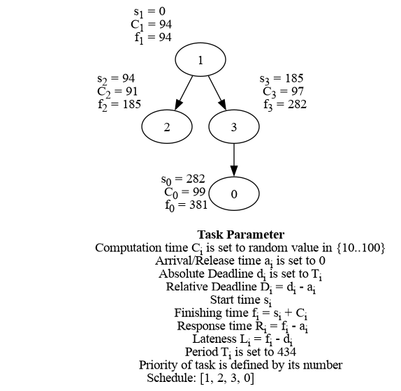

# Beispielaufruf von taskgraphs mit --nodes 6 --edges 4 --option 2 --graphs 2 --csv graph --drs 1

Es sollen 2 Graphen mit 6 Knoten und 4 Kanten durch die G(n,m) Erdos Renyi Variante generiert werden und zusätzlich zum normalen Output ein Parameter File namens 'graph' erstellt werden.

---

Als erstes werden die 6 Knoten zufällig auf die 2 Graphen verteilt. Das Terminal zeigt:

```
Nodes were distributed on graphs: [4, 2]
```

D.h. Graph 1 bekommt 4 Knoten, Graph 2 bekommt 2 Knoten.

---

Als nächstes werden die 4 Kanten zufällig verteilt, da '--option 2' gewählt wurde. Dabei wird berücksichtigt, dass zB Graph 2 nur zwei Knoten hat und maximal 1 Kante bekommen kann um danach als DAG generiert werden zu können.

Das Terminal zeigt:

```
Edges were distributed on graphs: [3, 1]
```

D.h. Graph 1 bekommt 3 Kanten, Graph 2 bekommt 1 Kante. 

Zusammenfassend:

```
The graph 1 will be generated with option 2, nodes = 4 and edges = 3
The graph 2 will be generated with option 2, nodes = 2 and edges = 1
```

----

Als nächstes wird die Utilization '--drs 1' berechnet:

```
Distributing total processor utilization U = 1 with drs
Generating default upper bounds that ensure the task has an execution time of at most 100
Generating default lower bounds that ensure the task has an execution time of at least 10
Lower bounds: [0.049019607843137254, 0.049019607843137254, 0.049019607843137254, 0.049019607843137254, 0.09615384615384616, 0.09615384615384616] 
Upper bounds: [0.49019607843137253, 0.49019607843137253, 0.49019607843137253, 0.49019607843137253, 0.9615384615384616, 0.9615384615384616]
Computed vector: [0.19049140197555375, 0.05332192314449407, 0.21868779721135329, 0.19198954703782653, 0.15557115286515322, 0.1899381777656192]
```

Da keine bounds mitgegeben wurden, wird 10/T_i als lower bound und 100/T_i als upper bound verwendet. Dabei ist T_i die Periode einer Task i, wobei die Perioden auf die Summe aller Computation times in einem Graphen gesetzt werden, d.h. in einem Graphen haben alle Tasks dieselbe Periode.

Danach werden die entsprechenden U_i Werte für die Graphen ausgewählt und die Computation times angepasst, damit das Verhältnis stimmt. Außerdem werden die Graphen gespeichert.

```
Subvector for utilization of graph 0: [0.19049140197555375, 0.05332192314449407, 0.21868779721135329, 0.19198954703782653]
Parameter file successfully created 'graph1.csv'
Graph 1 saved as 'graph1.dot', 'graph1.svg' and 'graph1.png'


Subvector for utilization of graph 1: [0.15557115286515322, 0.1899381777656192]
Parameter file successfully created 'graph2.csv'
Graph 2 saved as 'graph2.dot', 'graph2.svg' and 'graph2.png'
```

---

graph1.png und graph1.csv:


| Task/Priority | Start time | Computation time | Absolute deadline | Relative deadline | Finishing time | Response time | Lateness | Arrival time | Period | Utilization       |
| ------------- | ---------- | ---------------- | ----------------- | ----------------- | -------------- | ------------- | -------- | ------------ | ------ | ----------------- |
| 0             | 56         | 39               | 204               | 204               | 95             | 95            | -109     | 0            | 204    | 0.191176470588235 |
| 1             | 0          | 11               | 204               | 204               | 11             | 11            | -193     | 0            | 204    | 0.053921568627451 |
| 2             | 11         | 45               | 204               | 204               | 56             | 56            | -148     | 0            | 204    | 0.220588235294118 |
| 3             | 95         | 39               | 204               | 204               | 134            | 134           | -70      | 0            | 204    | 0.191176470588235 |

---

graph2.png und graph2.csv:



| Task/Priority | Start time | Computation time | Absolute deadline | Relative deadline | Finishing time | Response time | Lateness | Arrival time | Period | Utilization       |
| ------------- | ---------- | ---------------- | ----------------- | ----------------- | -------------- | ------------- | -------- | ------------ | ------ | ----------------- |
| 0             | 0          | 16               | 104               | 104               | 16             | 16            | -88      | 0            | 104    | 0.153846153846154 |
| 1             | 16         | 20               | 104               | 104               | 36             | 36            | -68      | 0            | 104    | 0.192307692307692 |
